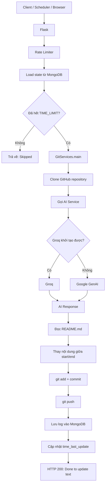
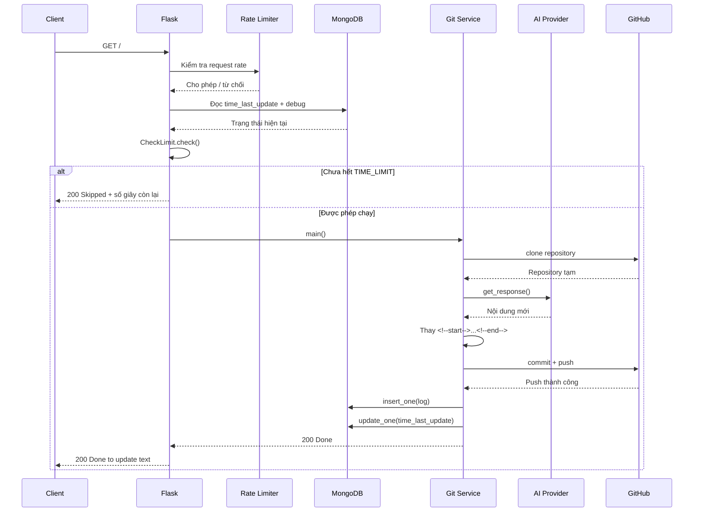

# MonoLine

> Tự động tạo một đoạn nội dung bằng AI và cập nhật trực tiếp vào `README.md` của GitHub repository theo chu kỳ cấu hình sẵn.

MonoLine là một dịch vụ Flask nhỏ gọn, hoạt động theo mô hình **configuration-driven**: người triển khai tự cung cấp toàn bộ thông tin cần thiết thông qua `.env`. Ứng dụng không thiết kế endpoint để nhận dữ liệu nghiệp vụ từ người dùng; route chính chỉ kích hoạt quy trình cập nhật đã được cấu hình sẵn.

> **Lưu ý về dữ liệu:** MonoLine không nhận dữ liệu đầu vào động từ client, nhưng nó **có giao tiếp ra ngoài** với các dịch vụ mà người dùng cấu hình: GitHub để clone/push repository, nhà cung cấp AI để sinh nội dung và MongoDB để lưu trạng thái/log.

---

## ✨ Tính năng

- 🤖 Hỗ trợ sinh nội dung bằng **Groq** và có **Google GenAI** làm fallback.
- 🔄 Tự động clone repository GitHub, sửa phần nội dung nằm giữa:
  ```html
  <!--start-->
  ...
  <!--end-->
  ```
  rồi commit và push lại.
- ⏱️ Có cơ chế giới hạn thời gian giữa hai lần cập nhật thông qua MongoDB.
- 🚦 Có rate limiting ở tầng Flask.
- 🧾 Lưu log kết quả AI và commit vào MongoDB.
- 🧹 Repository tạm thời được tạo bằng `tempfile` và xóa sau khi hoàn thành.
- 🔐 Toàn bộ credential được lấy từ biến môi trường.
- 🛠️ Có chế độ `DEBUG` và trạng thái debug lưu trong MongoDB để bỏ qua time limit khi cần kiểm thử.

---

## 🧠 Kiến trúc tổng quan



### Luồng request chi tiết



---

# 📁 Cấu trúc project

Các module hiện tại cho thấy project được tổ chức theo hướng:

```text
.
├── app/
│   ├── __init__.py
│   ├── core/
│   │   ├── ai_service.py
│   │   └── git_automation.py
│   ├── database/
│   │   ├── __init__.py
│   │   ├── connect_db.py
│   │   └── create_index.py
│   └── utils/
│       ├── __init__.py
│       ├── check_limit.py
│       └── logger.py
│
├── configs.py
├── prompts/
│   └── system_prompts.py
├── .env
└── ...
```

> Tên file/package trong repository thực tế nên khớp với các import hiện tại. Ví dụ `git_automation.py` import `app.core.ai_service`, `app.database`, `app.utils.logger` và `configs`.

---

# ⚙️ Cách hoạt động

## 1. Flask nhận request

Route chính là:

```text
GET /
```

Mỗi request đi qua rate limiter trước. Sau đó Flask đọc trạng thái cập nhật gần nhất từ collection `time_limit` trong MongoDB.

Nếu chưa đến thời điểm chạy tiếp theo, server **không gọi GitHub và không gọi AI**, mà trả về:

```text
Skipped: Rate limit active (<seconds>s left)
```

---

## 2. Kiểm tra `TIME_LIMIT`

MonoLine lưu timestamp lần cập nhật cuối:

```text
time_last_update
```

Công thức kiểm tra:

```text
elapsed = current_time - time_last_update
```

Nếu:

```text
elapsed < TIME_LIMIT
```

thì lần chạy đó bị bỏ qua.

Nếu `DEBUG=True` hoặc trạng thái `debug` trong MongoDB đang bật, giới hạn thời gian có thể được bỏ qua để phục vụ kiểm thử.

Giá trị mặc định:

```text
TIME_LIMIT=3600
```

tức khoảng **1 giờ**.

---

## 3. Clone GitHub repository

Ứng dụng tạo URL repository theo cấu trúc:

```text
https://<GITHUB_USER_TOKEN>@github.com/<GITHUB_USERNAME>/<GITHUB_USERNAME>.git
```

Điều này có nghĩa repository mà MonoLine thao tác là:

```text
github.com/<GITHUB_USERNAME>/<GITHUB_USERNAME>
```

Sau đó repository được clone vào một thư mục tạm:

```text
/tmp/monoline_...
```

Sau khi quy trình kết thúc, thư mục tạm được xóa.

---

## 4. Sinh nội dung bằng AI

AI service sử dụng prompt được lấy từ:

```text
prompts.system_prompts.SYSTEM_PROMPT
```

### Provider chính

Mặc định MonoLine cố gắng khởi tạo:

```text
Groq
```

với model:

```text
llama-3.3-70b-versatile
```

### Fallback

Nếu việc khởi tạo Groq thất bại, code chuyển sang:

```text
Google GenAI
```

với model mặc định:

```text
gemma-4-31b-it
```

### Khi gọi AI

Groq sử dụng:

```python
client.chat.completions.create(...)
```

Google GenAI sử dụng:

```python
client.interactions.create(...)
```

Nếu request tới provider AI phát sinh exception, service trả về:

```text
RES_DEFAULT
```

Mặc định:

```text
i'm sorry
```

---

# 📝 5. Cập nhật `README.md`

Sau khi nhận được text từ AI, MonoLine tìm đoạn:

```html
<!--start-->
...
<!--end-->
```

và thay toàn bộ nội dung ở giữa bằng response mới.

Ví dụ README ban đầu:

```markdown
# My Profile

<!--start-->
Nội dung cũ
<!--end-->

## Projects
...
```

Sau khi chạy:

```markdown
# My Profile

<!--start-->
Nội dung do AI sinh
<!--end-->

## Projects
...
```

### ⚠️ Bắt buộc phải có marker

Repository đích phải chứa:

```html
<!--start-->
<!--end-->
```

Nếu không tìm thấy hai marker này, quá trình cập nhật sẽ thất bại và server trả về HTTP `500`.

---

# 🔐 6. Commit và push

Nếu nội dung được thay đổi thành công:

```bash
git add README.md
```

Sau đó MonoLine tạo UUID:

```text
<uuid>
```

và commit:

```text
Id: <uuid>
```

Cuối cùng:

```bash
git push
```

Nếu push thành công, log sẽ ghi nhận commit ID.

---

# 🗃️ 7. MongoDB

MongoDB có hai mục đích chính:

### `time_limit`

Lưu trạng thái lần cập nhật gần nhất.

Dữ liệu có dạng tương tự:

```json
{
  "username": "your-github-username",
  "time_last_update": 1720000000,
  "debug": false
}
```

Collection này có unique index trên:

```text
username
```

### `ai_res`

Lưu log các lần AI tạo nội dung.

Dữ liệu được ghi gồm:

```json
{
  "username": "your-github-username",
  "id_commit": "uuid",
  "message": "AI generated text",
  "time": 1720000000
}
```

Việc ghi log `ai_res` được chạy trong một background thread để không chặn response chính.

---

# 🚀 Cài đặt

## Yêu cầu

Khuyến nghị sử dụng:

- Python **3.10+**
- Git
- Một GitHub repository có quyền push
- MongoDB
- API key Groq
- API key Google GenAI nếu muốn sử dụng fallback

---

## 1. Clone project

```bash
git clone <YOUR_REPOSITORY_URL>
cd <YOUR_PROJECT_DIRECTORY>
```

---

## 2. Tạo virtual environment

### Linux / macOS

```bash
python3 -m venv .venv
source .venv/bin/activate
```

### Windows

```powershell
python -m venv .venv
.venv\Scripts\activate
```

Kiểm tra:

```bash
python --version
```

---

## 3. Cài dependencies

Các thư viện mà source hiện tại sử dụng gồm:

```text
Flask
flask-limit
pydantic
pydantic-settings
python-dotenv
pymongo
GitPython
groq
google-genai
```

Cài đặt:

```bash
pip install Flask flask-limit pydantic pydantic-settings python-dotenv pymongo GitPython groq google-genai
```

Nếu repository đã có `requirements.txt`, ưu tiên:

```bash
pip install -r requirements.txt
```

---

# 🔑 Cấu hình `.env`

Đây là bước quan trọng nhất.

Tạo file:

```text
.env
```

ở thư mục gốc project:

```text
project/
├── .env
├── configs.py
├── app/
└── ...
```

Không đặt credential trực tiếp trong source code.

---

## Mẫu `.env`

```env
# ==============================
# SERVER
# ==============================

HOST=0.0.0.0
PORT=2011

DEBUG=false
TESTING=false


# ==============================
# AI
# ==============================

ROLE_AI=user

GROQ_API_KEY=your_groq_api_key
GENAI_API_KEY=your_google_genai_api_key

MODEL_GROQ_AI=llama-3.3-70b-versatile
MODEL_GEN_AI=gemma-4-31b-it

RES_DEFAULT=i'm sorry


# ==============================
# GITHUB
# ==============================

GITHUB_USERNAME=your_github_username
GITHUB_USER_TOKEN=your_github_token


# ==============================
# DATABASE
# ==============================

MONGO_URI=mongodb://localhost:27017/

DB_NAME=MonoLine


# ==============================
# TIME / RATE LIMIT
# ==============================

TIME_LIMIT=3600

RATELIMITE_LIMIT=500
RATELIMIT_PERIOD=5h
```

---

# 📌 Giải thích từng biến môi trường

## Server

| Biến | Mặc định | Ý nghĩa |
|---|---:|---|
| `HOST` | `0.0.0.0` | Host Flask bind |
| `PORT` | `2011` | Port HTTP |
| `DEBUG` | `false` | Bật debug mode của ứng dụng |
| `TESTING` | `false` | Chế độ testing |

---

## AI

| Biến | Mặc định | Ý nghĩa |
|---|---|---|
| `ROLE_AI` | `user` | Role gửi vào Groq |
| `GROQ_API_KEY` | bắt buộc | API key Groq |
| `GENAI_API_KEY` | bắt buộc | API key Google GenAI |
| `MODEL_GROQ_AI` | `llama-3.3-70b-versatile` | Model Groq |
| `MODEL_GEN_AI` | `gemma-4-31b-it` | Model fallback Google GenAI |
| `RES_DEFAULT` | `i'm sorry` | Response khi AI lỗi |

`GROQ_API_KEY` và `GENAI_API_KEY` là field bắt buộc theo `Pydantic Settings`.

---

## GitHub

| Biến | Mặc định | Ý nghĩa |
|---|---|---|
| `GITHUB_USERNAME` | bắt buộc | Username GitHub |
| `GITHUB_USER_TOKEN` | bắt buộc | Token dùng để clone/push |

Repository được code hiện tại xây dựng từ:

```text
https://<TOKEN>@github.com/<USERNAME>/<USERNAME>.git
```

Vì vậy GitHub repository cần có tên trùng với username.

---

## MongoDB

| Biến | Mặc định | Ý nghĩa |
|---|---|---|
| `MONGO_URI` | bắt buộc | MongoDB connection URI |
| `DB_NAME` | `MonoLine` | Database name |

Khi khởi tạo MongoDB client, ứng dụng sử dụng timeout:

```text
timeoutMS=5000
serverSelectionTimeoutMS=5000
maxIdleTimeMS=45000
```

---

## Time / Rate Limit

| Biến | Mặc định | Ý nghĩa |
|---|---:|---|
| `TIME_LIMIT` | `3600` | Khoảng thời gian tối thiểu giữa hai lần cập nhật |
| `RATELIMITE_LIMIT` | `500` | Số request theo rate limiter |
| `RATELIMIT_PERIOD` | `5h` | Khoảng thời gian rate limit |

---

# 🔐 GitHub Token cần quyền gì?

MonoLine cần:

1. Clone repository.
2. Commit file `README.md`.
3. Push commit lên repository.

Vì vậy token phải có quyền đủ để **đọc và ghi repository đích**.

Không nên sử dụng quyền rộng hơn mức cần thiết.

> **Quan trọng:** không commit `.env` lên GitHub.

Thêm vào `.gitignore`:

```gitignore
.env
.venv/
__pycache__/
*.py[cod]
```

---

# 🗄️ Thiết lập MongoDB

## Cách 1 — MongoDB local

Cài MongoDB rồi chạy service.

Ví dụ URI:

```env
MONGO_URI=mongodb://localhost:27017/
```

Database:

```env
DB_NAME=MonoLine
```

Ứng dụng sẽ tự `ping` MongoDB khi khởi tạo connection.

Nếu connection thành công, console sẽ có:

```text
Successfully connected to MongoDB
```

---

## Cách 2 — MongoDB Atlas

Tạo cluster trên MongoDB Atlas và lấy connection string.

Ví dụ:

```env
MONGO_URI=mongodb+srv://<username>:<password>@<cluster>/<database>?retryWrites=true&w=majority
```

Sau đó đảm bảo IP của máy chạy MonoLine nằm trong Network Access của Atlas.

---

# 🧱 Tạo index MongoDB

Project có module tạo unique index:

```python
db.time_limit.create_index("username", unique=True)
```

Mục đích là đảm bảo mỗi GitHub username chỉ có một record trong `time_limit`.

Nếu project của ông có script riêng để chạy index, thực hiện nó sau khi cấu hình `.env` và MongoDB.

---

# ▶️ Chạy ứng dụng

## Cách khuyến nghị: Flask CLI

Nếu package Flask nằm tại `app/` và có `create_app()`:

```bash
flask --app app run --host 0.0.0.0 --port 2011
```

Hoặc để Flask lấy host/port theo cấu hình project:

```bash
flask --app app run
```

Server mặc định sử dụng:

```text
http://127.0.0.1:2011
```

---

## Kiểm tra

Mở:

```text
http://127.0.0.1:2011/
```

Nếu đủ điều kiện chạy, response thành công là:

```text
Done to update text
```

Nếu đang trong thời gian chờ:

```text
Skipped: Rate limit active (<seconds>s left)
```

---

# 🔁 Toàn bộ quy trình chạy một lần

```text
GET /
   │
   ▼
Rate Limiter
   │
   ▼
Read MongoDB state
   │
   ▼
Check TIME_LIMIT
   │
   ├── Chưa đủ thời gian ─────► HTTP 200 Skipped
   │
   ▼
Clone GitHub repository
   │
   ▼
Call AI
   │
   ├── Groq
   │    └── lỗi khi khởi tạo → Google GenAI
   │
   ▼
Read README.md
   │
   ▼
Find <!--start--> ... <!--end-->
   │
   ▼
Replace content
   │
   ▼
git add README.md
   │
   ▼
git commit
   │
   ▼
git push
   │
   ├── lỗi ───────────────► HTTP 500
   │
   ▼
Save ai_res log
   │
   ▼
Update time_limit
   │
   ▼
HTTP 200 Done to update text
```

---

# 🧪 Chế độ Debug

Có hai nguồn có thể cho phép bỏ qua time limit:

```env
DEBUG=true
```

hoặc field:

```json
{
  "debug": true
}
```

trong record của `time_limit`.

Khi debug được bật, `CheckLimit` có thể cho phép chạy ngay cả khi `TIME_LIMIT` chưa hết.

### Khuyến nghị

Không bật:

```env
DEBUG=true
```

trên production nếu không cần thiết.

---

# 🛠️ Troubleshooting

## `NO .ENV FILE FOUND`

Nguyên nhân:

- Không có `.env`.
- Chạy project từ sai working directory.
- `.env` không nằm ở vị trí `find_dotenv()` có thể tìm thấy.

Kiểm tra:

```bash
ls -la
```

và chắc chắn có:

```text
.env
```

---

## Pydantic báo thiếu biến môi trường

Các biến bắt buộc gồm:

```text
GROQ_API_KEY
GENAI_API_KEY
GITHUB_USERNAME
GITHUB_USER_TOKEN
MONGO_URI
```

Kiểm tra `.env`:

```env
GROQ_API_KEY=...
GENAI_API_KEY=...
GITHUB_USERNAME=...
GITHUB_USER_TOKEN=...
MONGO_URI=...
```

---

## MongoDB timeout

Nếu log có dạng:

```text
Error: Connection timed out
```

kiểm tra:

1. MongoDB có đang chạy không.
2. `MONGO_URI` có đúng không.
3. Nếu dùng Atlas, IP đã được whitelist chưa.
4. Username/password MongoDB có đúng không.
5. Network/DNS có hoạt động không.

---

## `README.md not found`

MonoLine clone repository rồi tìm:

```text
README.md
```

Nếu repository không có file này, update thất bại.

Tạo file:

```text
README.md
```

trong repository trước.

---

## Không tìm thấy `<!--start-->` hoặc `<!--end-->`

README phải có cả hai marker:

```html
<!--start-->
<!--end-->
```

Ví dụ:

```markdown
## Dynamic content

<!--start-->
Nội dung sẽ được thay đổi tự động.
<!--end-->
```

---

## Git push thất bại

Kiểm tra:

```env
GITHUB_USERNAME=...
GITHUB_USER_TOKEN=...
```

và đảm bảo:

```text
https://github.com/<USERNAME>/<USERNAME>.git
```

tồn tại.

Ngoài ra kiểm tra token còn hiệu lực và có quyền ghi repository.

---

## AI trả về `i'm sorry`

Ứng dụng sử dụng:

```env
RES_DEFAULT=i'm sorry
```

làm response mặc định khi AI provider phát sinh exception.

Kiểm tra:

- API key.
- Model name.
- Kết nối Internet.
- Quota/rate limit của provider.
- Log console.

---

# 🔒 Bảo mật

## Không commit `.env`

Không bao giờ:

```bash
git add .env
git commit -m "add env"
git push
```

Hãy sử dụng:

```gitignore
.env
```

---

## Token GitHub

Code hiện tại truyền token trực tiếp trong Git URL để clone repository.

Điều này rất tiện cho automation nhưng cần bảo vệ token cẩn thận.

Nếu token bị lộ:

1. Revoke token ngay.
2. Tạo token mới.
3. Cập nhật `.env`.
4. Kiểm tra Git history/logs nếu token từng bị commit.

---

## Không log secret

Code Git automation có xử lý lỗi `GitCommandError` và thay token trước khi ghi log:

```text
ghp_github_token
```

thay cho token thật.

Dù vậy, vẫn nên coi `.env` và process environment là dữ liệu bí mật.

---

# 🌐 Data Flow / External Communication

MonoLine không có API nhận nội dung arbitrary từ client.

Dữ liệu di chuyển theo chiều:

```text
                  ┌──────────────────┐
                  │     Client       │
                  │   GET /          │
                  └────────┬─────────┘
                           │
                           ▼
                  ┌──────────────────┐
                  │      Flask       │
                  └───────┬──────────┘
                          │
             ┌────────────┴────────────┐
             ▼                         ▼
      ┌──────────────┐         ┌──────────────┐
      │   MongoDB    │         │   GitHub     │
      │ state / logs │         │ clone / push │
      └──────────────┘         └──────┬───────┘
                                      │
                                      ▼
                              ┌──────────────┐
                              │   README.md  │
                              └──────┬───────┘
                                     │
                                     ▼
                              ┌──────────────┐
                              │   AI API     │
                              │ Groq / GenAI │
                              └──────┬───────┘
                                     │
                                     ▼
                              generated text
                                     │
                                     ▼
                              README.md update
                                     │
                                     ▼
                                git push
```

### Vì vậy:

**Input từ client:**

```text
Không có payload nghiệp vụ.
```

**Nguồn cấu hình:**

```text
.env
```

**Dữ liệu bên ngoài được ứng dụng chủ động truy cập:**

```text
GitHub
AI provider
MongoDB
```

---

# 📊 HTTP Response

## Thành công

```http
HTTP/1.1 200 OK
Content-Type: text/plain

Done to update text
```

## Đang bị giới hạn thời gian

```http
HTTP/1.1 200 OK
Content-Type: text/plain

Skipped: Rate limit active (1234s left)
```

## Git automation thất bại

```http
HTTP/1.1 500 Internal Server Error
Content-Type: text/plain

Failed to update repository: Check server logs for details.
```

## Lỗi nội bộ

```http
HTTP/1.1 500 Internal Server Error
Content-Type: text/plain

Internal server error during the update process.
```

---

# ⏱️ Automation / Scheduler

MonoLine không tự tạo scheduler trong phần code được cung cấp. Endpoint `/` là điểm kích hoạt quy trình.

Có thể gọi endpoint bằng:

- cron
- systemd timer
- GitHub Actions
- Docker scheduler
- cloud scheduler
- một máy chủ khác gọi HTTP

Ví dụ cron:

```cron
0 * * * * curl -fsS http://127.0.0.1:2011/
```

Với cấu hình mặc định:

```env
TIME_LIMIT=3600
```

thì dù endpoint bị gọi nhiều lần, MongoDB time limit vẫn chặn các lần update quá sớm.

---

# 🧩 AI Provider Fallback

Cơ chế provider hiện tại:

```text
Start
  │
  ▼
Initialize Groq
  │
  ├── thành công ──► dùng Groq
  │
  └── exception ───► khởi tạo Google GenAI
                         │
                         └──► dùng GenAI
```

Lưu ý: fallback trong code xảy ra khi **khởi tạo `GroqAIServices` thất bại**. Không phải mọi lỗi API phát sinh sau đó đều làm ứng dụng tự chuyển provider.

Ví dụ:

```text
Groq được khởi tạo thành công
        │
        ▼
request tới Groq thất bại
        │
        ▼
RES_DEFAULT
```

---

# 🧾 Commit Format

Mỗi lần cập nhật thành công tạo commit message theo dạng:

```text
Id: <UUID>
```

Ví dụ:

```text
Id: 7f1c2d15-b7d0-4e9d-9d8a-3e1234567890
```

UUID này cũng được lưu trong collection:

```text
ai_res
```

---

# 🧹 Temporary Files

Mỗi lần chạy Git automation, ứng dụng tạo thư mục tạm bằng `tempfile`.

Sau khi quá trình kết thúc, thư mục đó được xóa trong `finally`.

Điều này giúp tránh việc giữ lại các bản clone repository trong filesystem lâu dài.

---

# 🛡️ Error Handling

Code hiện tại xử lý các nhóm lỗi chính:

### Git

```text
GitCommandError
FileNotFoundError
Exception
```

### MongoDB

```text
ServerSelectionTimeoutError
ConnectionFailure
Exception
```

### AI

```text
Exception
```

### HTTP

```text
500 Internal Server Error
```

Mục tiêu là không để exception nội bộ làm lộ credential trực tiếp trong HTTP response.

---

# ✅ Checklist triển khai

```text
[ ] Đã cài Python
[ ] Đã cài Git
[ ] Đã tạo virtual environment
[ ] Đã cài dependencies
[ ] Đã tạo .env
[ ] Đã nhập GROQ_API_KEY
[ ] Đã nhập GENAI_API_KEY
[ ] Đã nhập GITHUB_USERNAME
[ ] Đã nhập GITHUB_USER_TOKEN
[ ] Đã nhập MONGO_URI
[ ] Đã kiểm tra MongoDB
[ ] GitHub repository tồn tại
[ ] Repository có README.md
[ ] README.md có <!--start--> và <!--end-->
[ ] .env đã nằm trong .gitignore
[ ] Đã tạo index username cho time_limit
[ ] Đã chạy Flask
[ ] Đã test GET /
```

---

# 🧪 Test nhanh

Sau khi server chạy:

```bash
curl http://127.0.0.1:2011/
```

### Lần chạy đầu

Nếu MongoDB chưa có `time_last_update`, quá trình có thể chạy:

```text
GET /
→ check limit
→ clone repo
→ gọi AI
→ update README
→ commit
→ push
→ log MongoDB
→ update time_last_update
→ Done
```

### Gọi lại quá sớm

```text
GET /
→ check limit
→ Skipped
```

---

# 🔄 Ví dụ một session hoàn chỉnh

Giả sử:

```env
GITHUB_USERNAME=myuser
TIME_LIMIT=3600
```

Repository:

```text
https://github.com/myuser/myuser
```

README:

```markdown
# myuser

<!--start-->
old content
<!--end-->
```

Request đầu tiên:

```text
GET /
```

AI tạo:

```text
Building things one line at a time.
```

README trở thành:

```markdown
# myuser

<!--start-->
Building things one line at a time.
<!--end-->
```

Sau đó MonoLine:

```text
git add README.md
git commit -m "Id: <UUID>"
git push
```

MongoDB lưu:

```json
{
  "username": "myuser",
  "id_commit": "<UUID>",
  "message": "Building things one line at a time.",
  "time": 1720000000
}
```

Request tiếp theo trong vòng 3600 giây:

```text
Skipped: Rate limit active (...)
```

---

# 🧰 Khuyến nghị production

Trước khi expose service ra Internet, nên:

- Chạy sau reverse proxy.
- Dùng HTTPS.
- Không để `.env` xuất hiện trong repository.
- Dùng GitHub token có quyền tối thiểu cần thiết.
- Giới hạn MongoDB network access.
- Không bật `DEBUG` trên production.
- Giám sát log và lỗi Git/AI/MongoDB.
- Cấu hình scheduler bên ngoài để gọi `/`.
- Cân nhắc cơ chế secret management nếu deploy trên cloud.

---

# 📜 License

Chưa có thông tin license trong source được cung cấp.

Nếu repository sử dụng license riêng, hãy thay phần này bằng license chính thức của project.

---

# 🤝 Contributing

1. Fork repository.
2. Tạo branch mới:

```bash
git checkout -b feature/my-feature
```

3. Thực hiện thay đổi.
4. Test local.
5. Commit:

```bash
git commit -m "Add: my feature"
```

6. Push branch.
7. Tạo Pull Request.

---

# ⭐ Tóm tắt

MonoLine có thể được hiểu đơn giản như:

```text
.env
  │
  ├── GitHub credentials
  ├── AI credentials
  ├── MongoDB URI
  └── Runtime limits
          │
          ▼
       Flask
          │
          ▼
    Check time limit
          │
          ▼
      GitHub clone
          │
          ▼
        AI call
          │
          ▼
    Update README.md
          │
          ▼
    Commit + Push
          │
          ├──────────────► GitHub
          │
          └──────────────► MongoDB logs/state
```

MonoLine không cần client gửi nội dung để hoạt động. Người triển khai chỉ cần cấu hình `.env`, chuẩn bị repository đúng format và cung cấp các dịch vụ phụ thuộc; phần còn lại được tự động hóa theo flow trên.